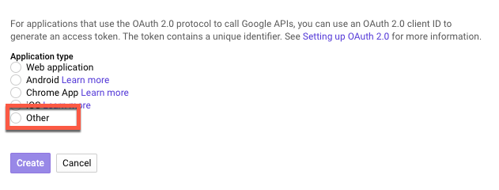

## Introduction
Getting started with the Google Ads API can sometimes be a frustrating experience. There's lots of steps, and the online tutorials can be hard to follow. Here we try to describe the process step by step in one fell swoop.

Don't get discouraged. It's a lot, but you'll get there. Here's what we're going to do:

- Create a Google Ads manager account (unless you already have one)
- Apply for a developer token in the manager account
- Create a Google Ads **manager** TEST account
- Create a Google Ads **regular** TEST account
- Create some campaigns in the regular test account
- Create a project in Google Cloud
- Enable the Google API in the Cloud Project
- Get OAUTH credentials in the Cloud Project
- Download those credentials as a JSON
- Install the Google Ads API library using pip
- Clone the Google Ads API Git repo
- Run a special script found within the repo to get a refresh token
- Copy a YAML file from the API library to your home folder
- Edit the YAML file to add your OAUTH credentials, developer token, and refresh token
- Run an API call

Easy, right? Let's get started.

## Get a Google Ads Manager Account
There are two types of Google Ads accounts.

- A **regular** account. This is an account that's used to create and run ads in Google.
- A **manager** account. This is an umbrella account that's used to manage one or more regular accounts.

Manager accounts are only for managing regular accounts, you can't use them to create or manage ads. For example, if you're a marketing agency you will own two accounts: a regular account to manage your own agency's ads, and a manager account to manage ads on behalf of your clients.

If you don't already have a manager account, you'll need to set one up. You can do that from the [Google Ads Manager Homepage](https://ads.google.com/home/tools/manager-accounts/).

## Get a developer token
Everyone needs multiple credentials to use the API, and a developer token is the first. It's easy to get. Log into your Manager account and navigate to TOOLS & SETTINGS > SETUP > API Center. (The API Center option will appear only for Google Ads Manager Accounts.)


Fill out the form, accept the terms and conditions, and submit. Make sure you use a real email address that you check regularly. Once your token is granted, it'll appear as a string of numbers and letters in the API Center. It's the part that's fuzzed out in the image below.


Copy this value and paste it somewhere you can access it later, like a text editor.

## Set up a Google Ads TEST Manager account
Initially Google will not provide you API access to live-in-production accounts. If you want to work with the API you'll need a non-production test account. To do that, you need to again create an MCC by going back to the [Google Ads Manager Homepage](https://ads.google.com/home/tools/manager-accounts/) and create a second manager account using the same email address as your first manager account.

This will create a test account for you, which is easy to spot because of the red "test account" badge:


## Set up a Google Ads TEST regular accounts

The online instructions say to create test accounts "using the Google UI," which confuses some people. What you need to do is click on ACCOUNTS in the left hand nav bar and then click the "+" link.


**WARNING** The UI will complain that the account is unusable, give you a warning about billing information, and it'll seem like nothing has happened.


The forums are absolutely full of people complaining that they created a test account and nothing happened. Google is promising a fix, but if this happens to you know that the account is there, just hidden. Click on the filter and click "Show hidden."

Copy the regular test account number and paste the value somewhere accessible, like a text editor.

## Create a test campaign in your test account
Enter into your regular test account by clicking The link in the upper left of your Manager account:


I created three regular accounts, but it doesn't really matter how many you create. You'll only use one at a time. Select the account.

Create a campaign by clicking campaigns in the left sidebar and then the + link.


A word about test accounts: they don't have any real data in them. You can create campaigns, but they'll never be populated with any data, even dummy data.

People expect that a test account would have lots of fake data on impressions and clicks and budget and so on. Facebook does this with their test accounts, Google does not. There are many, many, many complaints about this in forums going back years, and Google shows no signs of changing anything.

Instead, and this is true, Google suggests that you download data from a production account as a CSV file and pretend that the API retrieved it.

## Set up your Google Cloud project
Did I mention this was a multi step process? To use the API, you'll need to create a Google Cloud project, enable the Google Ads API within it, and set up credentials.

To start, sign into [Google Cloud](https://console.cloud.google.com/) with the same account as your Manager Account.

### Create a Google Cloud project
In the upper left, select the project you want to use with the Google Ads API. If you don't have a project, click New Project.


If you are prompted for billing information at any time (and it's likely you will if you haven't already entered a credit card), you'll need to do that. Unless you begin to make thousands of API calls daily or use a lot of other cloud resources, you don't need to worry about billing.

### Enable the Google Ads API in your project

Make sure your project is selected, and click APIs and Services at the left


Click the + API and Services link at the top of the page that opens


Search for Google Ads. Select it when it appears and click the ENABLE button.  When you're asked for the application type, you'll probably want to select Installed App (select Web App if you are building a platform that people will use to access their account, which is very unlikely if you're just getting started).


### Create your credentials

Click the API and Services again, this time selecting credentials.


On the Credentials screen, click CREATE CREDENTIALS, then select OAuth client ID.


For the type, select "Other"




Two credentials will be created, a client ID and a secret. Copy these values and paste them somewhere you can get to them later, like a text editor.

Note that once you close this modal, only the Client ID will appear on the main credentials page. To access the secret again, click on the name of your OAUTH credentials:


And you'll be able to get to your secret:


### Download your credentials as a json file

On the credentials page, to the far right of your OAUTH credentials, you'll see a download icon. Click this to download your credentials as a JSON.


The file that's downloaded has a huge name. To make it easy to work with, I suggest renaming it to "secrets.json" or something similar. Move the file out of the downloads directory and into an easy-to-access place, like your home directory.

## Get the API library on your computer

Now it's time to get the Google Ads API on your computer and make a test API call!

First enter into a Python virtual environment. If you're not sure what those are or how to set one up, we have a [handy tutorial available for you](/resources/virtual-environments-in-anaconda).

Once you're in your virtual environment, you'll need to [install setup tools](https://pypi.org/project/setuptools/). It's a prerequisite for the API library.

Next, install the library using pip. Type this into your terminal

```
pip install google-ads
```

The library has lots of example code that you might want easy access to, so I like to clone the API library Git repo right into my home library.

```
git clone git@github.com:googleads/google-ads-python.git
```

Enter the library and run the setup test to ensure everything is installed correctly


```
python setup.py test
```

## There's one last credential we need to get

I know, right? Think of all this work as a barrier to competition. The final credential is a refresh token, which is a special value that is used to, well, refresh your credentials once they expire.

To do this, you'll need to enter the google-ads-python directory that was created when you cloned the git repo, and go into the examples/authentication folder

```
cd examples/authentication
```

There should be three files in this folder. The one we want is authenticate_in_standalone_application.py. Run it, and add the location of the json file you downloaded from the OAUTH step way up above. Type this into your terminal (changing the /path/to/secrets.json as the actual path and name to your json file).

```
./authenticate_in_standalone_application.py --client_secrets_path=/path/to/secrets.json
```

This snippet will return a URL, looking something like this:


**Open a private browser session** or "incognito" browser session. This URL contains sensitive credentials and you don't want them saved to your history. Copy and paste the URL into the private browser session.

Click allow


An authorization code will be shown to you.


Copy and paste the verification code into the command line where you're running the authenticate_in_standalone_application.py example and press enter.

```
After approving the token enter the authorization code here: ****

```

The example should complete and display an offline refresh token.


```
After approving the token enter the authorization code here: ****
Your refresh token is: ****
```

Copy and paste that refresh token somewhere accessible, like a text editor.

## Rounding up all your credentials and geting them configured

You now should have set of values sitting somewhere accessible, like a text editor. Time to put them to use.

By default, the Google Ads API looks for all your credentials in a yaml file in the home directory called google-ads.yaml. This file is sitting within the google-ads-python directory you cloned from github in a step above. What you need to do is

1. Copy the yaml file
2. Paste it into the home directory
3. Enter in all the credentials you worked so hard to get

Here's what the file looks like. When you've moved the file to the home directory, edit it and add the appropriate information, and save it.


## Make your first API call!
At long last, here we are. We're goign to make an API call to retrieve the name of the campaign you created in the test account.

First, let's go the appropriate example script.

```
cd google-ads-python/examples/basic_operations
```
Next, we run the get_campaigns.py, passing the test account number as an argument.

```
python get_campaigns.py -c1234567890
```

Notice how I passed the account ID with no spaces or dashes? Now, if all went well with your configuration, you'll get a response, something similar to:

```
Campaign with ID xxxxxxxxxxx and name "Campaign-Name-1" was found.
```
